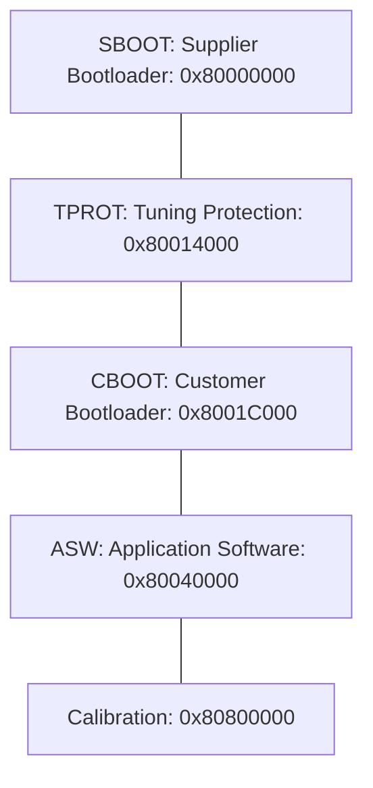
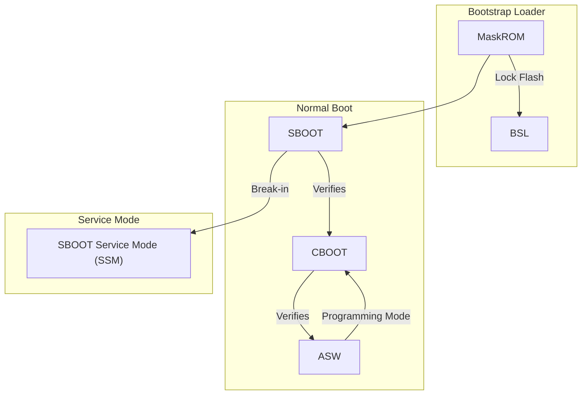
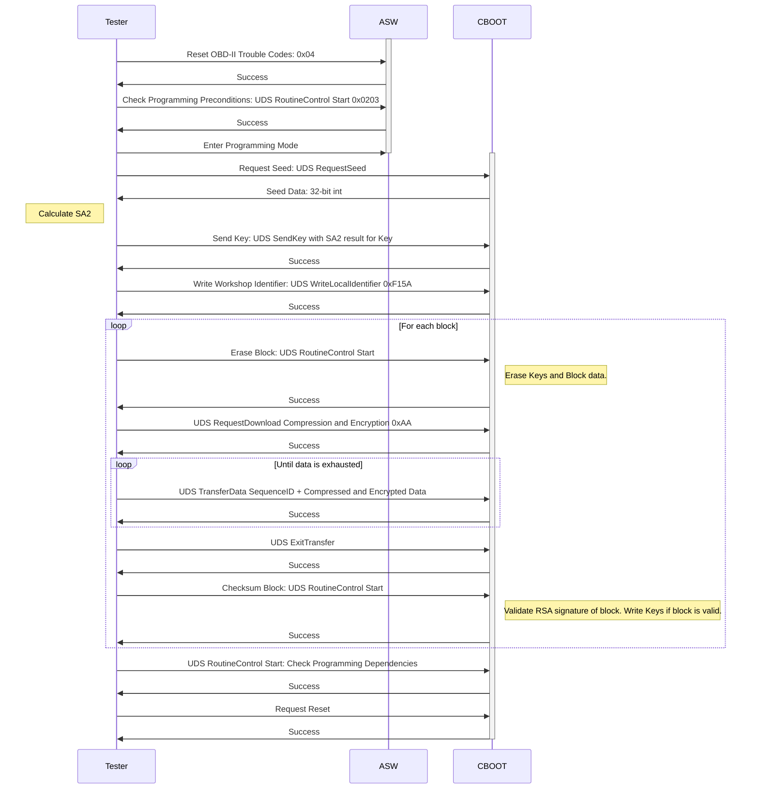

# Exploiting the Simos18 Engine Control Unit

Brian Ledbetter
BSides Denver 2021

---

# About Me

* Learned embedded reverse engineering on the iPhone 1 and PSP.
* Now a boring corporate manager.
* Self taught - you can do it too!
* No background in automotive industry or embedded software.
    * I'm sure those with a background in the field will grate their teeth at the way I describe things. Feedback is welcome!
* Built full free, open-source toolchain for reflashing and tuning Simos control modules, DSG-DQ250, Haldex4Motion Gen5. 
* https://github.com/bri3d/VW_Flash
* Independently discovered and built an exploit for Simos Service Mode (SSM) for "boot/bench" reprogramming Simos control modules.
* https://github.com/bri3d/Simos18_SBOOT

---

# Why this talk?

* Drum up interest in automotive reverse engineering.
* ECU reverse engineering is an awful lot like most other embedded systems.
* Fun, inexpensive, and rewarding.
* Used ECUs available for under $50 all day on eBay.
* Tune your own car!

---

# Why target Simos18 (what's a Simos18 anyway?)

* It's the control unit used in many modern VW cars.
* Manufactured by Siemens/Continental.
* Part of a lineage of "Simos" ECUs.
* Competes with mainly Bosch.
* Present in my 2016 Golf R.
* Didn't trust commercial / off the shelf reprogramming options - too many hidden changes, too little owner control.

---
layout: two-cols
---

# ECU Basics

* Just a lightly-hardened embedded computer with a LOT of I/O.
* Takes inputs from sensors (cam, crank, air mass/pressure).
* Outputs combustion signals: fuel, air, spark, compression - injector, spark coils, throttle, cam phasing, wastegate actuator.
* More air = more fuel = more power
* Other reasons too - for example, exhaust flaps configuration to quiet down car.
* **End goal is to be able to modify "calibration" section of Flash.**

::right::

---

# Online Resources

* [NefMoto](http://nefariousmotorsports.com/forum/index.php)
* MHH
* ECUConnections
* So sketchy
* So bad
* But useful?

---

# ECU markets and makers

* Japan based automakers: Mostly use SuperH CPU. Denso, Keihin. Entirely unprotected or weak protections until recently.
* US based automakers: Complete mix. Most modern Fords use Bosch, GMs have some Delphi, some Delco.  Some use PowerPC (Freescale), some TriCore. Usually don't have strong protection installed, even for the same ECU family as European counterparts.
* European automakers: Bosch or Continental (Siemens + Valeo). C167, Tricore, and PowerPC, with some SuperH thrown in for good measure. In recent years, mostly centralized on Tricore.

---

# Embedded reverse engineering crash course

* Read the Internet
* Locate pictures
* Find CPU and memory map
* Read CPU documentation
* Find firmware dump
* Understand software architecture
* Fire up Ghidra
* Look for ways in

---
layout: two-cols
---

::right::
* Infineon CPU for ECUs.
* Common across many vendors.
* Doesn't have 3 cores. Really.
* 32 bit.
* MCU style architecture. Flat address space, execution directly from Flash.
* On-chip Flash, protected by boot sequence. No external Flash to dump.
* Processore core has optimizations for RTOS, task contexts / independent stacks.
* Differs from other CPUs in peripheral support. GPTA high-precision signal acquisition/generation complex, safety tools, ADCs.
* Open documentation! Open-ish toolchain! A dream!

---

# TriCore Resources

* [Architecture Manual](https://www.infineon.com/dgdl/tc1_6__architecture_vol1.pdf?fileId=db3a3043372d5cc801373b0f374d5d67)
* [Instruction Set Reference](https://www.infineon.com/dgdl/Infineon-AURIX_TC3xx_Architecture_vol2-UserManual-v01_00-EN.pdf?fileId=5546d46276fb756a01771bc4a6d73b70)
* [EABI](https://www.infineon.com/dgdl/TriCore_EABI_v2_3.pdf?fileId=db3a304412b407950112b40f8d7a142b)
* [Processor Manual](https://www.infineon.com/dgdl/TC1798_um_v1_2.pdf?fileId=db3a304331c8f8560131d2812a8e066b)
* [HighTec GCC](https://free-entry-toolchain.hightec-rt.com)

---

# Security architecture

* Flash is protected by passwords in flash controller.
* Not encrypted, but...
* No external access to Flash. Physically integrated on CPU die.
* Can't read/write Flash without Boot Passwords.
* Unsigned code execution on CPU (Bootstrap Loader / BSL), but Flash is locked.
* Debugger disabled.

--- 

# Interfaces

* About a million different pins. Connected to various parts of the car. Analog and digital I/O.
* CAN bus: simple 2-wire differential signaling. Message-based interface for controller communications.
* Freeform. Each message has an ID and a payload, that's it.
* Very different across vendors.
* Don't overfit!
* Layers above CAN:
  * ISO-TP
  * UDS
* CAN architecture:
  * ECU is on "powertrain CAN"
  * OBD port is on "diagnostic CAN"
  * Bridged by a Gateway which only passes certain messages.

---

# Exploit Hardware

* Raspberry Pi
* Good combination of basic I/O, reasonably controlled timing, easy tooling, access to CAN peripherals. 
* CAN Hat
* MCP2517FD
* MCP2515 drivers are horrible, avoid!
* python-can

---

# Documentation

* Random hints and tricks online.
* VW Flashdaten has FRF/ODX files in it.
* Leaked ASAP2 A2L files: compiler variable locations / memory map from compilation process.
* Leaked "Funktionsrahmen."
* ASAM/ODX documentation.
* UDS documentation.

---
layout: two-cols
---
# Software blocks and Architecture

* Simple RTOS. Fixed timeslicing and real-time scheduling. 
* Bootloaders SBOOT and CBOOT handwritten in MISRA C.
* TPROT is a statically linked library containing RSA, AES, and SHA functions as well as public key material.
* Application Software model-generated using Simulink into MISRA C and then compiled.
* HighTec and Tasking are main compilers. Both GCC based so source available from a GPL request.

::right::

---

# Boot order

---

# Front doors

* TriCore BSL
* SBOOT Service Mode (proprietary).
* CBOOT Application Reprogramming (UDS)

---

# TriCore BSL

* Send unsigned code over CAN, it runs.
* Requires HWCFG pins configured, so ECU needs to be opened and test points modified.
* CPU manufacturer mandated.
* Flash is locked.
* No access to Flash without passwords.
* Probably some kind of glitching/timing/mega elite low level exploit, but I don't know about it.
* Can access RAM, and RAM persists over reboot (!).

---

# SBOOT Service Mode (SSM)

* Not accessible without removing ECU.
* Factory programming.
* Break in using PWM waveforms and CAN messages.
* Proprietary command loop.
* CRC validation.
* RSA-based seed/key.
* Accepts a **signed** stage 2 bootloader, with full access to Flash. 

---

# Customer Bootloader Reprogramming (CBOOT / UDS)

* Accessible over OBD port (behind Gateway).
* Dealer programming.
* ASAM/ODX documented standardized reprogramming process, using ODX "layers."
* Initialization protected using SA2 virtual machine seed/key authentication.
* CRC validation.
* Only accepts AES128 encrypted payloads. Fixed Key and IV, stored in flash.
* Normally payload is also LZSS compressed.
* Flashing finalization protected by SHA1-PKCS#1.5-RSA2048 signatures.

---

# Ghidra setup

* HighTec toolchain
* Tricore documentation
* Address map
* Register map

---

# Let's go on a trip through Ghidra

---

# SBOOT Exploit summary

* Proprietary signals to enter Service Mode. Service mode accepts bootloader over the wire. Bootloader is executed with Flash unlocked. **Jackpot**! Unless...
* Ordered via state machine. Enter Service Mode -> Setup -> Seed/Key -> Upload -> Execute
* Seed/Key: Encrypt 256 bytes of Mersenne Twister data using RSA public key. Expect decrypted data back. Should require private key.
* Flaw: Weak PRNG seeded with 31 bits of entropy from system timer. No real entropy and even if there were entropy, it's not enough.
* Signature check: SHA1-PKCS#1.5-RSA2048. e=65537. Padding verified. Addresses mixed into SHA1 data. Looks strong.
* But wait! CRC run before sigcheck. CRC bounds check is weak. Can checksum boot passwords. We're in!

---

# UDS Reprogramming

---

# CBOOT Application Reprogramming exploit

* Application reprogramming specified by ODX/ASAM standards.
* UDS protocol.
* Encryption and compression: 0xAA: "Audi AES" and "Audi LZSS". AES with fixed key/IV stored in ROM. LZSS compression.
* Seed/Key. VW SA2 virtual machine.
* Programming Session -> Seed/Key -> Erase -> Request Download -> TransferData -> Checksum -> Exit -> Reset
* Not enough RAM to buffer a full flash, not enough flash to store 2 software images, so flash has to be direct-written.
* "OK Flags" / "Keys" / "Security Blocks"

---

# CBOOT State Machine

* EraseBlock -> Erases security flags.
* Direct upload to Flash, but never executed without security flags.
* Checksum -> Writes security flags.
* All security flags must be written.
* Sigchecking goes through same code as SBOOT, in TProt/OTP module. SHA1-PKCS#1.5-RSA2048, e=65537.

---

# CBOOT bug

* *"WriteWithoutErase"* exploit.
* Weird backdoor overwrite functionality with Compression = 0.
* State machine does not verify that Erased block was Checksummed block.
* Arbitrary overwrite of block marked as Valid, maintaining OK/Keys flag.
* But it's overwrite - can only flip bits up.
* ECC.

---

# CBOOT exploit / ASW patch

* Use CBOOT against itself.
* Descend into CBOOT patched into Sample Mode.
* Need to find a patch location in ASW with more than 64 bits of `00` (ECC-safe)
* Initialization routine! Perfect.

---

# ECU Timeline

* External flash, no protections. Pre-ME7. Put flash in a programmer, overwrite calibration, done.
* External flash, multi-point checksums. ME7. Need to reverse-engineer checksumming algorithms to allow data to validate.
* [External flash, RSA signature checking. ME7.1.1/ME7.5](https://github.com/nyetwurk/ME7Sum). RSA keys stored in external flash. Could re-key with own public key and self-sign firmware.
* Internal flash, no signature checking, checksums, no passwords. Early Simos PCR. No way to program using external programmer. Bootstrap loader could read/write Flash.
* Internal flash, no signature checking, checksums, passwords set. Early MED9, most other control modules to date (DSG, Haldex). Needed to reverse-engineer factory programming flow and Seed/Key to write, and create a reader tool if desired to export passwords.
* Internal flash, inherent trust, signature checking, passwords predictable. Late MED9, early MED17. Could reverse-engineer password derivation algorithm and access using bootstrap loader.
* Internal flash, inherent trust, signature checking, passwords unpredictable. Simos18, MED17/MG1. Need to exploit signature checking or service mode.
* Internal flash, TrustZone, no inherent trust, signature checking, passwords unpredictable.

---

# Choose your own adventure

* Current state of the world (TrustZone, validation, etc.)?
* Application software patching?
* Other control modules (DSG, Haldex)?
* Other topics in automotive reverse engineering?